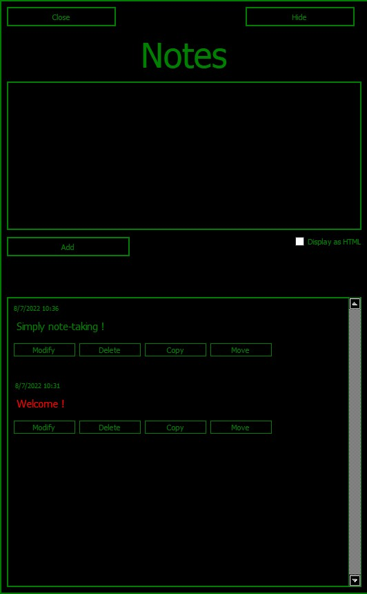

# Qapharnaum
Simple note-taking software

[Download stable version](https://github.com/SultanRancho/Qnote/raw/main/note.exe)
# Illustration


# Tips
Create a Windows shortcut and associate it to a keyboard shortcut for start with keyboard.

# For dev
Require:
```shell
  pip install PyQt5
  pip install keyboard
  pip install functools
```
